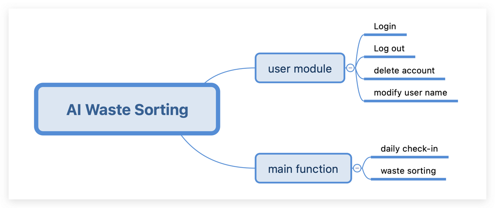
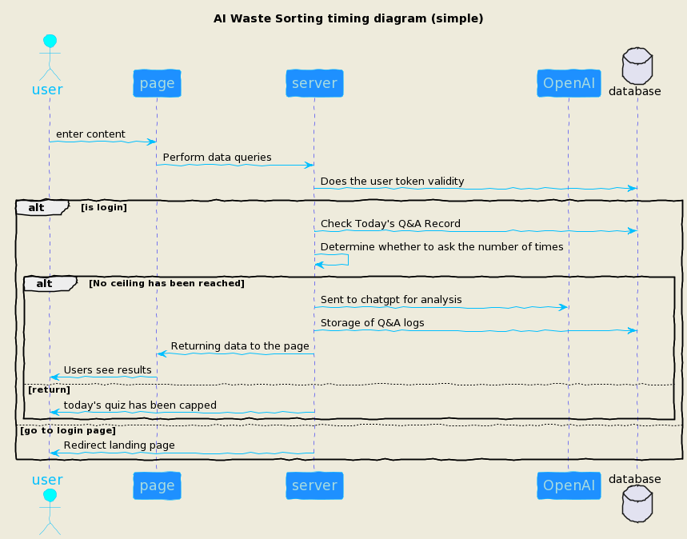
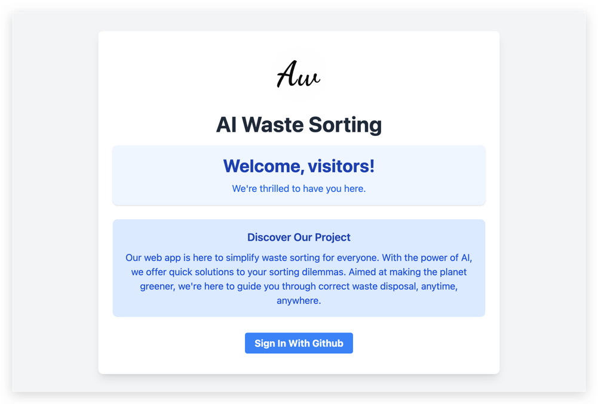

# Project Name: AI Waste Sorting

## Online-Visit

First I've deployed to the server，You can access the experience online by **clicking [here](http://itmd54x-fp-yifan.someget.work/)**

## Project Description

In today's world, sorting our trash correctly is super important for keeping our planet healthy. But, let's be honest,
it can be pretty confusing sometimes. That's why I'm making a new website as my fianl project to help everyone out!.
This site is all about making waste sorting simple and clear.

Here's the deal: if you're not sure where to throw your trash, just ask our website. We're using some smart AI
technology to give you quick answers on how to sort your waste. You can ask up to 5 questions every day for free. And if
you check in on the site daily, you get to ask 10 questions a day!

I really hope this website will make waste sorting easier for everyone. By getting better at this, we can all do our
part for the environment and our community.

This project stands as a testament to the cutting-edge skills and knowledge acquired in the ITMD-544 course, brilliantly
woven into its fabric. Developed with Express and Node.js, it not only showcases a simple yet profoundly functional
interface but also embodies the essence of responsive design. By integrating Pug as the template engine and TailwindCSS
for styling, this web application transcends ordinary user experiences, offering a seamless and captivating interaction
across various devices. It's a vivid demonstration of how classroom learning can be transformed into real-world
solutions, illuminating the path for future innovations.

## Technology Stack

### Backend

- **Node.js**: A JavaScript runtime built on Chrome's V8 JavaScript engine, facilitating the execution of JavaScript
  code server-side.
- **Express**: A minimal and flexible Node.js web application framework, providing a robust set of features for web and
  mobile applications.

### Frontend

- **Pug**: A high-performance template engine implemented with JavaScript for Node.js and browsers, known for its clean
  and simple syntax.
- **Tailwind CSS**: A utility-first CSS framework for creating custom designs directly in your markup.

### Database

- **SQLite**: A C-language library that implements a small, fast, self-contained, high-reliability, full-featured, SQL
  database engine.

### AI Model

- **OpenAI GPT-4**: The latest generation of artificial intelligence language models developed by OpenAI, capable of
  understanding and generating human-like text.

### ORM Tool

- **TypeORM**: An ORM that can run in Node.js, Browser, Cordova, PhoneGap, Ionic, React Native, NativeScript, Expo, and
  Electron platforms and can be used with TypeScript and JavaScript (ES5, ES6, ES7, ES8).

### Authentication Framework

- **GitHub Authentication**: Utilizes GitHub's OAuth 2.0 authentication system to enable users to authenticate with
  GitHub credentials, providing a secure and streamlined sign-in process.

In this project, I will integrate several concepts we discussed in the ITMD-544 course to build a complete tech stack
CRUD (Create, Read, Update, Delete) application. I will apply the latest advancements in web technology and artificial
intelligence that I have learned so far to develop a modern, efficient, and user-friendly web application.

## Data Structure

I'm using the mysql specification for ddl here because I'm more familiar with it, but I'm actually using sqllite, and
writing the code is where I'll do the conversion

```sql
create table user
(
    id        bigint unsigned auto_increment comment 'pk' primary key,
    uid       bigint unsigned default 0 not null comment 'uid',
    user_name varchar(128) default ''                not null comment 'jwt token',
    token     varchar(128) default ''                not null comment 'jwt token',
    mtime     timestamp    default CURRENT_TIMESTAMP not null on update CURRENT_TIMESTAMP comment 'update time',
    ctime     timestamp    default CURRENT_TIMESTAMP not null on update CURRENT_TIMESTAMP comment 'create time',
    constraint uk_uid unique (uid),
    index     ix_token (token),
    index     ix_mtime (mtime),
    index     ix_ctime (ctime)
) comment 'user';

create table qa_record
(
    id       bigint unsigned auto_increment comment 'pk' primary key,
    uid      bigint unsigned default 0 not null comment 'uid',
    question varchar(500) default ''                not null comment 'question',
    answer   varchar(500) default ''                not null comment 'answer',
    date varchar(32) default ''                not null comment 'date e.g. 20230204',
    mtime    timestamp    default CURRENT_TIMESTAMP not null on update CURRENT_TIMESTAMP comment 'update time',
    ctime    timestamp    default CURRENT_TIMESTAMP not null on update CURRENT_TIMESTAMP comment 'create time',
    index    ix_mtime (mtime),
    index    ix_ctime (ctime),
    index      ix_uid_date (uid, date)
) comment 'qa_record';

create table daily_check
(
    id         bigint unsigned auto_increment comment 'pk' primary key,
    uid        bigint unsigned default 0 not null comment 'uid',
    check_date varchar(32) default ''                not null comment 'check_date e.g. 20230204',
    mtime      timestamp   default CURRENT_TIMESTAMP not null on update CURRENT_TIMESTAMP comment 'update time',
    ctime      timestamp   default CURRENT_TIMESTAMP not null on update CURRENT_TIMESTAMP comment 'create time',
    index      ix_mtime (mtime),
    index      ix_ctime (ctime),
    index      ix_uid_date (uid, check_date)
) comment 'qa_record';
```

## Function Introduction



## Waste Sorting core flow chart


## Waste Sorting Core Timing Chart



## API Document

### 1. `qa/do` - Garbage Sorting Inquiry

- **Request Type**: GET
- **Path**: `/do`
- **Parameters**:
  - `content` (query): The content of the query. It must be a string and cannot exceed 200 characters in length.
- **Responses**:
  - Success: `{code: 0, data: "Answer content", message: "success"}`
  - Failure:  `{code: 1, message: "Error message"}`

### 2. `qa/check-in` - User Check-in

- **Request Type**: POST
- **Path**: `/check-in`
- **Parameters**: None (uses `token` from cookies for authentication)
- **Responses**:
  - Success: `{code: 0, message: 'Check-in successful'}`
  - Failure: `{code: 1, message: 'Error message'}`

### 3. `users/logout` - User Logout

- **Request Type**: POST
- **Path**: `/logout`
- **Parameters**: None (clears all cookies)
- **Responses**:
  - Success: `{message: "Logout Success", code: 0}`

### 4. `users/delete` - Delete User Account

- **Request Type**: POST
- **Path**: `/delete`
- **Parameters**: None (uses `token` from cookies for authentication)
- **Responses**:
  - Success: `{message: "User deleted successfully", code: 0}`
  - Failure: `{message: "Error message", code: 1}`

### 5. `users/edit-username` - Edit Username

- **Request Type**: POST
- **Path**: `/edit-username`
- **Parameters**:
  - `username` (body): New username to be updated.
- **Responses**:
  - Success: `{message: "User name updated successfully", code: 0}`
  - Failure: `{message: "Error message", code: 1}`

### 6. `/callback` - OAuth Callback

- **Request Type**: GET
- **Path**: `/callback`
- **Parameters**:
  - `code` (query): The code received from the OAuth provider to exchange for an access token.
- **Responses**:
  - Redirects to `/home` on success with `username` and `token` set in cookies.
  - Failure: `{message: "Internal Server Error", code: 1}`


## Screenshot
####  The website program

- Website lead-in page



- Home Page


- Q&A Interaction Page


- Result page after interaction


- Change User Name Screen


- Delete User Interface


####  ORM data


#### Postman interface

- Category Q&A interface(There are other api calls and insert data in there)


- Modify user name


- Delete User


####  Suthenticated token


## Installation/Running Instructions

To get this project up and running on your local machine, follow these steps:

1. **Clone the repository**:
   ```
   git clone https://github.com/oreoft/ITMD544-S24.git
   ```
2. **Navigate to the project directory**:
   ```
   cd final-project
   ```
3. **Install dependencies**:
   ```
   npm install
   ```
4. **Set up environment variables**:
   Create a `.env` file in the root directory and populate it with ai config variables. such as `QA_TOKEN=xxxx`(your
   config), This .evn content I will submit to the dashboard

5. **Start the application**:

- For development:

```
npm run dev
```

- For production:

```
npm run start
```

## References

- Express Documentation: https://expressjs.com/
- SQLite Documentation: https://www.sqlite.org/docs.html
- TailwindCSS Documentation: https://tailwindcss.com/docs
- Node.js Documentation: https://nodejs.org/en/docs/
- My Presentation Materials: https://yifan.prezo.site/itmd544-fp
