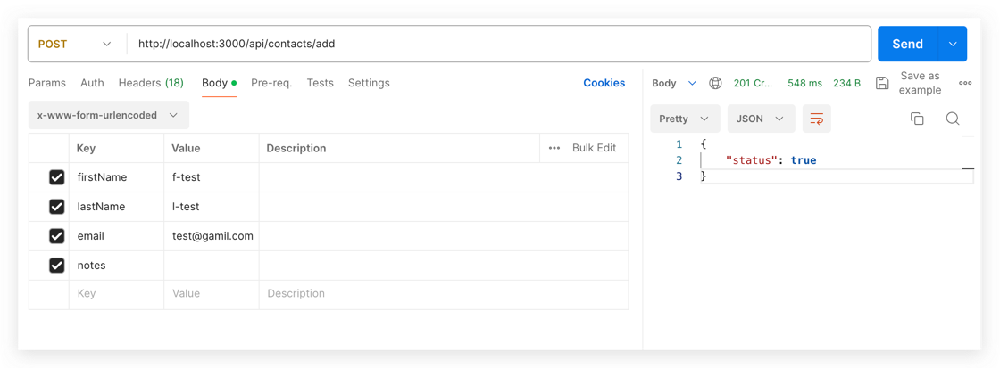
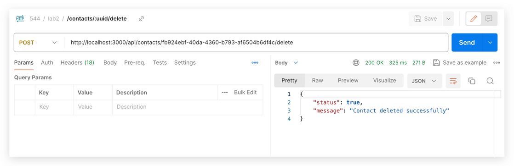
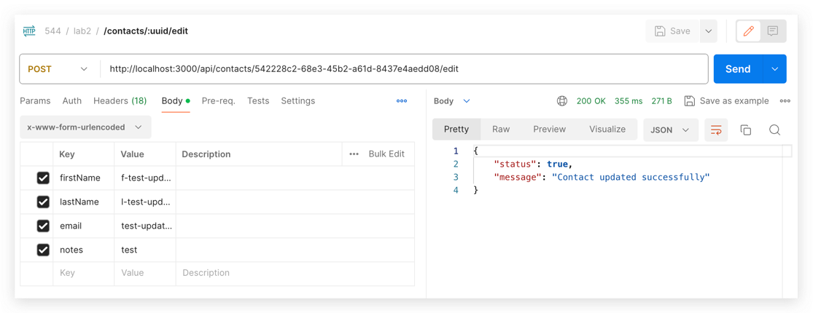
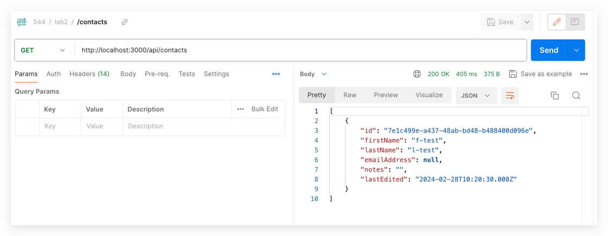

# ITMD-544-Lab2- CRUD Interface

You can access the experience online by *
*clicking [here](https://happy-desert-08aae5410.4.azurestaticapps.net/api/contacts)**

## Feature

This is a simple contact list application without login authentication. Its main features include

- viewing the contact lis,

- adding new contacts

- deleting contacts

- viewing individual contact information

- modifying contact information

## Docs

### Contacts API Documentation

Online Host is `https://happy-desert-08aae5410.4.azurestaticapps.net`

#### 1. Add Contact

- **POST** `/api/contacts/add`

##### Description

Adds a new contact to the system.

##### Request Body

- `firstName` (string): First name of the contact.
- `lastName` (string): Last name of the contact.
- `email` (string): Email address of the contact.
- `notes` (string, optional): Additional notes or comments about the contact.

#### 2. Delete Contact

- **POST** `/api/contacts/:uuid/delete`

##### Description

Deletes a specific contact from the system based on the contact's UUID.

##### URL Parameters

- `uuid` (string): The unique identifier of the contact to be deleted.

#### 3. Edit Contact

- **POST** `/api/contacts/:uuid/edit`

##### Description

Updates the information of an existing contact.

##### URL Parameters

- `uuid` (string): The unique identifier of the contact to be edited.

##### Request Body

- `firstName` (string): Updated first name of the contact.
- `lastName` (string): Updated last name of the contact.
- `email` (string): Updated email address of the contact.
- `notes` (string, optional): Updated notes or comments about the contact.

#### 4. List Contacts

- **GET** `/api/contacts`

##### Description

Retrieves a list of all contacts in the system.

##### Response

Returns a JSON array of contacts, each containing:

- `firstName` (string): First name of the contact.
- `lastName` (string): Last name of the contact.
- `email` (string): Email address of the contact.
- `notes` (string, optional): Additional notes or comments about the contact.

### Screenshot

- add
  
- delete
  
- update
  
- query
  
