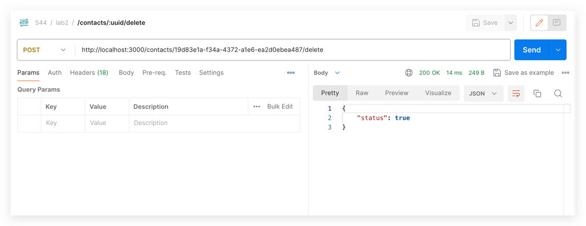
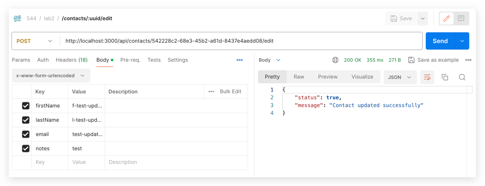
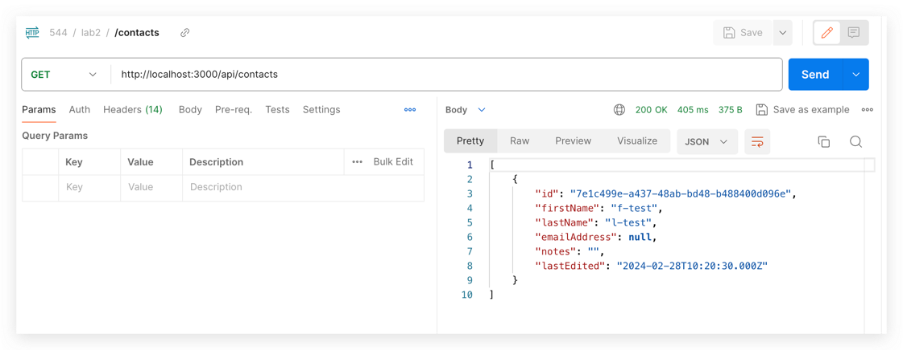

# ITMD-544-Lab2- CRUD Interface

You can access the experience online by **clicking [here](http://itmd542-lab2-yifan.someget.work/)**

## Feature

This is a simple contact list application without login authentication. Its main features include

- viewing the contact lis,

- adding new contacts

- deleting contacts

- viewing individual contact information

- modifying contact information

## Docs

### Api

### Screenshot

- add
  
- delete
  
- update
  
- query
  
